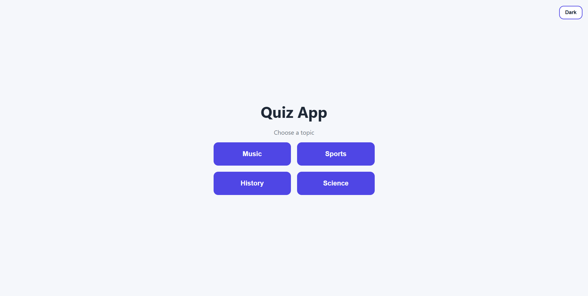
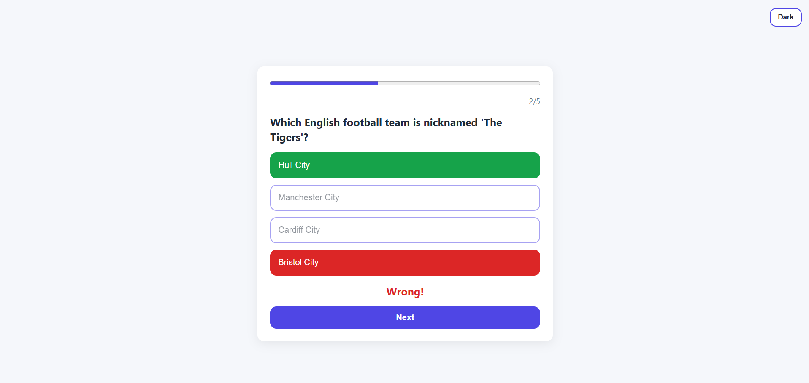
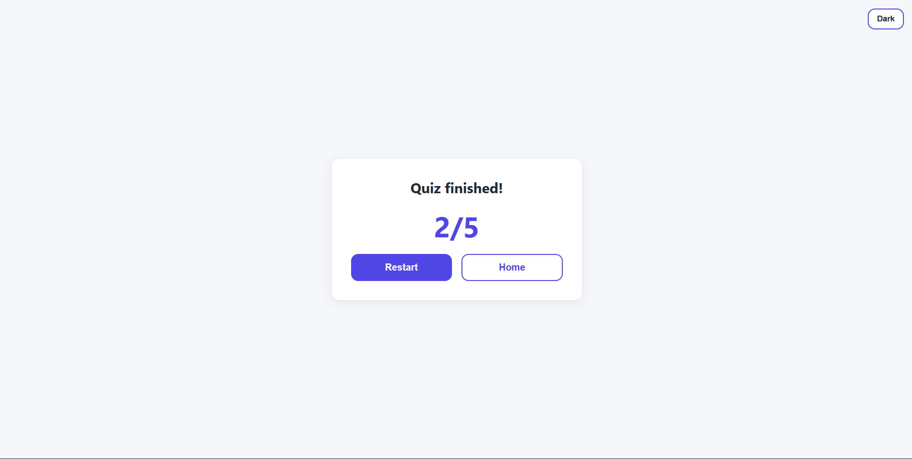

# Quiz App

A quiz app where you pick a topic and a difficulty, answer 5 questions, and get your score at the end.

**Live demo:** https://your-app.vercel.app





## Features
- Choose from 4 topics and 3 difficulty levels
- Questions fetched from the Open Trivia DB API, filtered by your choices
- Instant feedback on each answer, progress bar and final score
- Restart the same quiz or go back home
- Dark / light theme that remembers your choice

## Tech stack
- React (Vite)
- React Router (nested and dynamic routes: `/quiz/:topic/:difficulty`)
- Context API + `useReducer` for quiz state
- CSS Modules

## Run locally
```bash
git clone https://github.com/YOUR-USERNAME/quiz-app.git
cd quiz-app
npm install
npm run dev
```